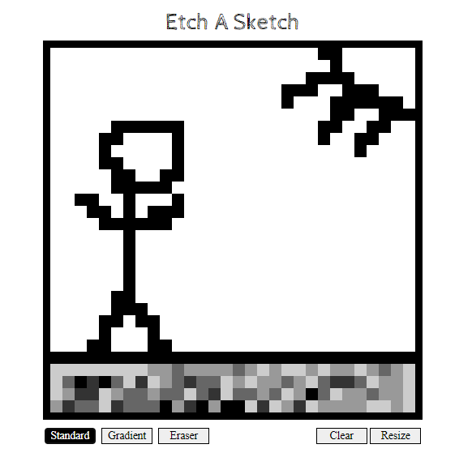

## Etch-a-Sketch
  This is a browser version of the popular toy: The Etch A Sketch

🔗 **Live preview** of the app is [here](https://j-haze.github.io/etch-a-sketch/).

### Purpose: ###
The purpose of this project was to create a fun interactive app while allowing me to expand upon my Web Development skills.

### Demonstrated Knowledge Of: ###

HTML, CSS, JavaScript, DOM Manipulation

### Notable Features: ###

* Change board resolution.
* Change drawing mode between solid and gradient.
* Erase specific squares or clear the whole board.

### My web toy in action: ###

